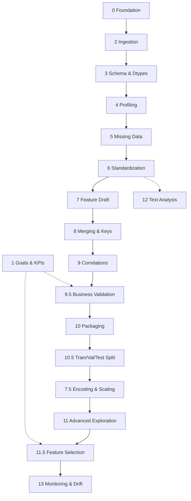

# Mind‑Q V3 — Pipeline Dependency Map (Phase‑to‑Phase Impact)

This document shows how phases depend on each other, what artifacts flow between them, and the downstream impact when a phase changes. Use it to plan safe changes and know which phases to re‑run.

## High‑level DAG

Legend: solid = primary flow, dotted = optional/auxiliary.

## Phase contracts and change impact

For each phase: Inputs (from artifacts), Core logic, Outputs (artifacts), Downstream consumers, and Change impact.

### Phase 2 — Ingestion & Landing

- Inputs: raw file(s) from user.
- Core: parse CSV/Excel/Parquet/JSON; recover malformed CSV; clean column names; write Parquet (Zstd); report compression/time.
- Outputs: `raw_ingested.parquet` (+ optional landing files).
- Downstream: Phase 3.
- Impact: schema or parsing change affects all later phases ⇒ re‑run 3→13.

### Phase 3 — Schema & Dtypes

- Inputs: `raw_ingested.parquet`.
- Core: infer/cast dtypes; categorize columns; generate schema JSON; warnings if violation rate > 2%.
- Outputs: `typed_data.parquet`, `feature_spec.json` (types), `profile_summary.json` (basic schema info).
- Downstream: Phases 4, 5, 6, 7, 12.
- Impact: dtype/category changes propagate to profiling, imputation, standardization, features. Re‑run 4→13. Minor thresholds may only require 4→9.

### Phase 4 — Profiling

- Inputs: `typed_data.parquet`.
- Core: numeric/categorical summaries; missingness; IQR outliers; top correlations preview.
- Outputs: `dq_report.json`, `profile_summary.json`.
- Downstream: Phase 5 (policy hints), Phase 9 preview.
- Impact: logic change does not alter data but affects reports/decisions; re‑run 4,5,9 if thresholds changed.

### Phase 5 — Missing Data

- Inputs: `typed_data.parquet`, optional group column.
- Core: decision tree (median/group median/KNN/MICE/flags); PSI+KS validation; status PASS/WARN/STOP.
- Outputs: `imputed_data.parquet`, `imputation_policy.json`.
- Downstream: Phases 6, 7, 8, 9, 10, 10.5, 7.5, 11, 11.5, 13.
- Impact: data values change ⇒ re‑run 6→13. Policy thresholds tweak ⇒ at least 5→9 and any model‑like phases (11/11.5).

### Phase 6 — Standardization

- Inputs: `imputed_data.parquet`, domain mappings.
- Core: Unicode/text normalization; domain mappings; collapse rare categories (size‑aware threshold).
- Outputs: `standardized_data.parquet`, `mapping_config.json`.
- Downstream: 7, 8, 9, 12.
- Impact: category distributions change ⇒ re‑run 7→9 (and 7.5 if encoded), 12 for text.

### Phase 7 — Feature Draft

- Inputs: `standardized_data.parquet`.
- Core: domain‑specific features (logistics/healthcare/retail/marketing/finance); cap selected outliers.
- Outputs: `features_data.parquet`, `feature_spec.json` (derived features).
- Downstream: 8, 9, 10, 10.5, 7.5, 11, 11.5, 13.
- Impact: column set changes ⇒ re‑run 8→13. If only capping thresholds changed, at least 9, 11, 11.5.

### Phase 8 — Merging & Keys

- Inputs: `features_data.parquet` + join tables.
- Core: key discovery (id*); duplicate handling; left joins; orphan quarantine/stop; optional merge of registered text tables before analytics.
- Outputs: `merged_data.parquet`, optional `orphans_*.parquet`.
- Downstream: 9, 10, 10.5, 7.5, 11, 11.5, 13.
- Impact: row set/columns change ⇒ re‑run 9→13. Duplicate/orphan thresholds tweak ⇒ at least 9, 10, 10.5, 7.5.

### Phase 9 — Correlations & Associations

- Inputs: `merged_data.parquet`.
- Core: Pearson for numeric, Chi‑square + Cramér’s V for categorical; FDR‑BH when many tests.
- Outputs: `correlations.json`, `correlation_matrix.json`.
- Downstream: 9.5, 10 (reports), 11.5 (as signal), documentation.
- Impact: only reports/analytics; re‑run 9.5 and packaging.

### Phase 9.5 — Business Validation

- Inputs: `correlations.json` + domain expectations (+ KPIs from Phase 1).
- Core: compare to expected relationships; classify conflicts; generate LLM hypotheses.
- Outputs: `business_validation.json`, `business_veto_report.json`.
- Downstream: 10 (packaging), governance.
- Impact: report‑level; re‑run 10 if logic/expectations change.

### Phase 10 — Packaging (pre‑split)

- Inputs: core artifacts from 4,5,6,7,8,9,9.5.
- Core: provenance, changelog, ZIP bundle.
- Outputs: `eda_bundle.zip`, `provenance.json`, `changelog.md`.
- Downstream: 10.5.
- Impact: no data change; only bundle contents. No downstream re‑run required unless consumers rely on bundle list/hash.

### Phase 10.5 — Train/Val/Test Split

- Inputs: `merged_data.parquet` (or features data if chosen).
- Core: stratified or time‑based split; report target distributions.
- Outputs: `train.parquet`, `validation.parquet`, `test.parquet`, `split_indices.json`.
- Downstream: 7.5, 11, 11.5.
- Impact: model‑oriented phases; any change requires re‑running 7.5, 11, 11.5.

### Phase 7.5 — Encoding & Scaling (on splits)

- Inputs: train/val/test.
- Core: OHE/Target/Ordinal on TRAIN; Standard/Robust scaling on TRAIN; transform VAL/TEST; save artifacts.
- Outputs: `train_encoded.parquet`, `validation_encoded.parquet`, `test_encoded.parquet`, `scaler_numeric.joblib`, encoder artifacts.
- Downstream: 11, 11.5.
- Impact: feature space changes ⇒ re‑run 11, 11.5.

### Phase 11 — Advanced Exploration

- Inputs: encoded TRAIN (and optionally VAL/TEST).
- Core: K‑Means (best k via silhouette), PCA (≥90% variance if many features), Isolation Forest anomalies.
- Outputs: `evaluation_report.json`, `pca_variance.json`, `anomaly_flag` in data (if persisted).
- Downstream: 11.5 (as signals), 13 (monitoring setup choice).
- Impact: analytics only; re‑run 11.5 if used as prior.

### Phase 11.5 — Feature Selection

- Inputs: encoded TRAIN/VAL and target.
- Core: RF importance + RFE; merge; force‑include business‑approved; VIF check < 5.
- Outputs: `selected_features.json`, `feature_importance.json`.
- Downstream: 13 (choose baseline set), modeling (future).
- Impact: feature set changes ⇒ update monitoring (13) and any modeling consumers.

### Phase 12 — Text Analysis (optional branch)

- Inputs: `standardized_data.parquet` (or earlier if only raw text).
- Core: text column detection; lightweight cleaning; basic features; keyword/bigram extraction; sentiment (MVP).
- Outputs: `llm_insights_report.json` (and basic text features per column).
- Downstream: packaging, BI docs.
- Impact: report‑level. Re‑package if logic changes.

### Phase 13 — Monitoring & Drift

- Inputs: typically TRAIN (or merged data) + selected features (11.5).
- Core: baseline mean/std; PSI/KS thresholds per feature.
- Outputs: `drift_config.json`, `signals.json` (if extended), baseline timestamp.
- Downstream: runtime monitors.
- Impact: configuration only; updating thresholds triggers redeploy of monitoring.

## Re‑run guidance (cheat‑sheet)

- Change at 2/3 (schema or parsing): re‑run 3→13.
- Change at 5 (imputation policy): re‑run 6→13.
- Change at 6 (mappings/rare collapse): re‑run 7→9 (+12 if text), then packaging.
- Change at 7 (derived features): re‑run 8→13.
- Change at 8 (join/keys): re‑run 9→13.
- Change at 9/9.5: re‑run 9.5 and 10.
- Change at 10.5 (split ratios): re‑run 7.5, 11, 11.5, 13.
- Change at 7.5 (encoding/scaling): re‑run 11, 11.5.

## Notes

- Artifacts names reflect the current `backend/artifacts/` set: `raw_ingested.parquet`, `typed_data.parquet`, `imputed_data.parquet`, `standardized_data.parquet`, `features_data.parquet`, `merged_data.parquet`, `train.parquet`, `validation.parquet`, `test.parquet`, `train_encoded.parquet`, `validation_encoded.parquet`, `test_encoded.parquet`, plus JSON reports/configs.
- Keep `provenance.json` updated with version and hashes to trace decisions across phases.
